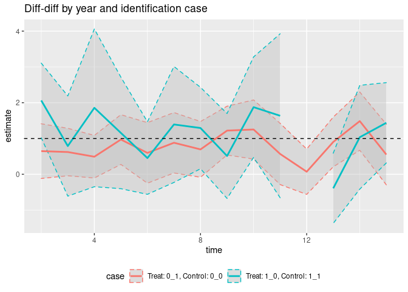

<!-- README.md is generated from README.Rmd. Please edit that file -->

# multiDiff

<!-- badges: start -->

[](https://www.tidyverse.org/lifecycle/#experimental)
<!-- badges: end -->

This R package implements the multi-period diff-diff as discussed in
Imai and Kim (2019) and Chaisemartin and Hautfeuille (2019).

## Installation

``` r
remotes::install_github("MatthieuStigler/multiDiff", upgrade = "never")
```

## Main functions:

  - `DD()`: period-by-period diff-diff (DiD)
  - `DD_manu()`: DiD the manual way: showing the four means
  - `DD_manu_many()`: period-by-period manual DiD
  - `FE_decompo()`: FE decomposition following Gibbons et al
  - `mDid_weights_CH()`: Weights from Chaisemartin and Hautefeuille
    (2020)

## Example

Main function is `DD()` (name might change\!), with following arguments

  - `y_var` The name of the y variable
  - `treat treatment` The name of the treatment variable
  - `time.index` The name of the *time* dimension variable
  - `unit.index` The name of the *unit* dimension variable
  - `data` The dataset

<!-- end list -->

``` r
library(multiDiff)
suppressMessages(library(tidyverse))
data <- sim_dat(N=100)
DD_out <- DD(data=data)

## Main output is:
knitr::kable(DD_out[1:5,])
```

| time | DiD | treat | control | n\_treat | n\_control | n\_min | miss\_data |    estimate | std.error |   statistic |   p.value |    conf.low | conf.high |    D\_var | n\_vals |
| ---: | --: | :---- | :------ | -------: | ---------: | -----: | :--------- | ----------: | --------: | ----------: | --------: | ----------: | --------: | --------: | ------: |
|    2 |   1 | 0\_1  | 0\_0    |       21 |         50 |     21 | FALSE      |   0.6462758 | 0.3832034 |   1.6865085 | 0.0962147 | \-0.1181941 |  1.410746 | 0.1269104 |     142 |
|    2 |   2 | 0\_1  | 1\_1    |       21 |          5 |      5 | FALSE      | \-0.1444697 | 0.7759808 | \-0.1861769 | 0.8538707 | \-1.7460153 |  1.457076 | 0.2454751 |      52 |
|    2 |   3 | 1\_0  | 0\_0    |       24 |         50 |     24 | FALSE      |   1.2720072 | 0.3211001 |   3.9614042 | 0.0001734 |   0.6319059 |  1.912108 | 0.1367899 |     148 |
|    2 |   4 | 1\_0  | 1\_1    |       24 |          5 |      5 | FALSE      |   2.0627527 | 0.5086024 |   4.0557271 | 0.0003818 |   1.0191867 |  3.106319 | 0.2468240 |      58 |
|    3 |   1 | 0\_1  | 0\_0    |       19 |         55 |     19 | FALSE      |   0.6212886 | 0.3327167 |   1.8673205 | 0.0659275 | \-0.0419699 |  1.284547 | 0.1126586 |     148 |

Plot the year-by-year treatment:

``` r
DD_out %>% 
  filter(DiD %in% c(1,4)) %>% 
  mutate(case = paste("Treat: ", treat, ", Control: ", control, sep = "")) %>% 
  ggplot(aes(x=time, y = estimate, color = case)) +
  geom_ribbon(aes(ymin = .data$conf.low, 
                    ymax = .data$conf.high,
                  group = case),
              fill = "grey", alpha = I(0.4),
              linetype = 2) +
  geom_line(size = 1) +
  theme(legend.position = "bottom") +
  geom_hline(yintercept =1, linetype = 2) +
  ggtitle("Diff-diff by year and identification case")
```



Aggregate the results over time:

``` r
DiD_aggreg(x=DD_out, by_DiD = FALSE)
#> # A tibble: 1 x 1
#>   estimate
#>      <dbl>
#> 1       NA
DiD_aggreg(x=DD_out, by_DiD = TRUE)
#> # A tibble: 2 x 4
#>     DiD treat control estimate
#>   <int> <chr> <chr>      <dbl>
#> 1     1 0_1   0_0        0.757
#> 2     4 1_0   1_1       NA
```
